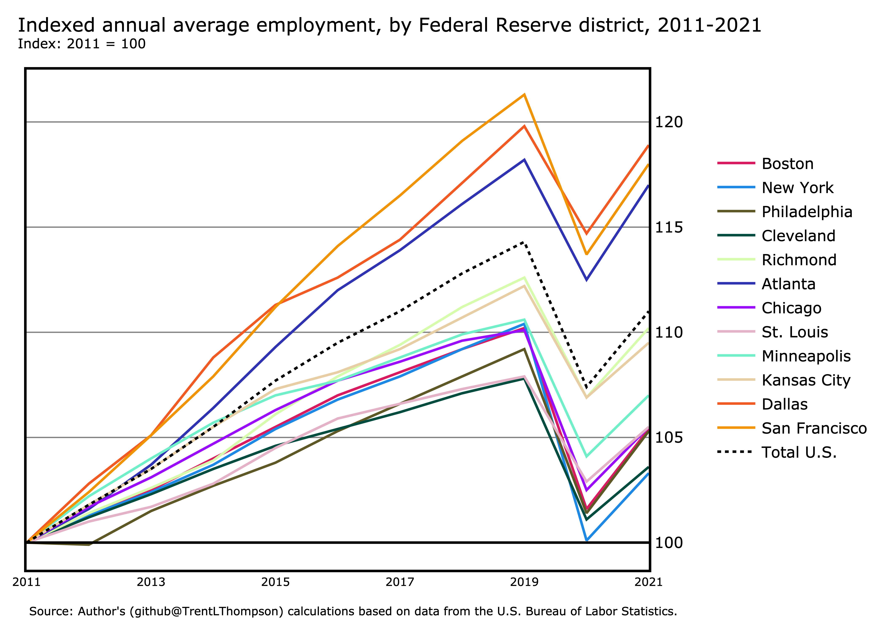

Last updated: March 10, 2023

# Federal Reserve District Employment & Wages

[Just give me the data!](https://github.com/TrentLThompson/federal-reserve-qcew/tree/main/03_outputs/02_csv)

According to data from the Bureau of Labor Statistics' Quarterly Census of Employment and Wages ([QCEW](https://www.bls.gov/cew/)), the San Francisco Federal Reserve district had the largest share of U.S. annual average employment (20.6%) in 2021, while the Minneapolis Federal Reserve district had the smallest share (3.2%).

From 2020 to 2021, annual average employment increased in all of the twelve Federal Reserve districts. The Atlanta Federal Reserve district had the largest over-the-year percentage increase in annual average employment (4.0 percent).

From 2020 to 2021, average annual pay increased in all of the twelve Federal Reserve districts. The San Francisco Federal Reserve district had the largest over-the-year percentage increase in average annual pay (7.2 percent).

From 2011 to 2021, annual average employment increased in all of the twelve Federal Reserve districts. The Dallas Federal Reserve district had the largest over-the-decade percentage increase in annual average employment (18.9 percent).

From 2011 to 2021, average annual pay increased in all of the twelve Federal Reserve districts. The San Francisco Federal Reserve district had the largest over-the-decade percentage increase in average annual pay (52.5 percent).

 Last updated: March 10, 2023